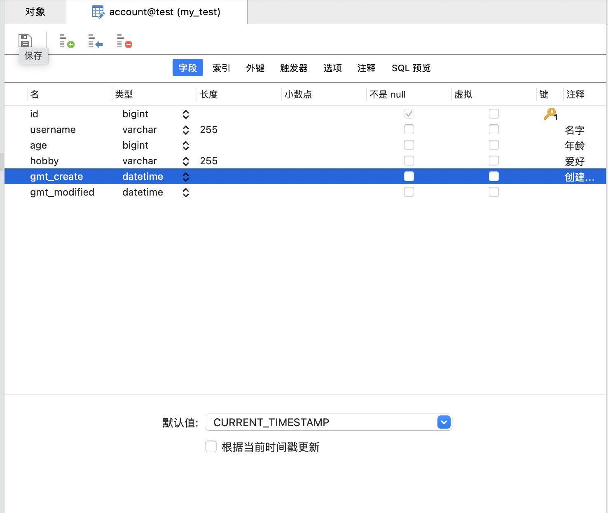

## ORM 框架-Sequelize

### 1. 初始化测试 node 项目

#### 基础初始化

```shell
mkdir testNode  // 创建文件夹

cd testNode     // 进入文件夹

npm init -y     // 初始化 npm

mkdir app.js	// 创建 node 项目启动根目录
```

#### 安装 node 项目依赖

```sh
npm i express cors
```

#### 配置 app.js 页面

```javascript
const express = require('express');
const app = express();
const cors = require('cors');
const Account = require('./models/Account');

app.use(cors());

app.listen(8081, () => {
  console.log('服务启动在: http://127.0.0.1:8081');
});
```

#### 启动 node 项目

- 安装热更新启动库

```shell
npm i -g nodemon
```

- 启动方式

```javascript
node app.js    // 普通启动

nodemon app.js  // 热更新启动
```

#### 安装数据库操作依赖

Sequelize 官网: https://www.sequelize.cn/core-concepts/getting-started

安装 sequelize

```sh
yarn add sequelize@6.24.0
```

安装 mysql 数据库安装驱动程序

```sh
yarn add mysql2@2.3.3
```

### 2. 链接数据库

#### 创建 confi/sequelize.js 文件，链接数据库

```javascript
const { Sequelize } = require('sequelize');

// database 数据库名字
// username 用户名
// password 密码
// host 数据库运行的服务器ip地址
// dialect 数据库类型
const sequelize = new Sequelize('test', 'root', 'xxxx', {
  host: 'xxxx',
  dialect: 'mysql'
});

module.exports = sequelize;
```

#### 测试连接

```javascript
const { Sequelize } = require('sequelize');

// database 数据库名字
// username 用户名
// password 密码
// host 数据库运行的服务器ip地址
// dialect 数据库类型
const sequelize = new Sequelize('test', 'root', '15468381.tan', {
  host: '159.75.253.154',
  dialect: 'mysql'
});

// 测试链接
(async function() {
  try {
    await sequelize.authenticate();
    console.log('数据库链接成功');
  } catch (error) {
    console.error('数据库链接失败:', error);
  }
})();

module.exports = sequelize;
```

#### 运行命令测试连接

根目录下运行以下指令：

```sh
node config/sequelize.js
```

### 3. 数据库模型具体操作

#### 定义模型

model/Account.js

```javascript
const { Sequelize, DataTypes } = require('sequelize');
const sequelize = require('../config/sequelize.js');

const Account = sequelize.define(
  'Account',
  {
    // 在这里定义模型属性
    id: {
      autoIncrement: true,
      type: DataTypes.BIGINT,
      allowNull: false,
      primaryKey: true
    },
    username: {
      type: DataTypes.STRING(255),
      allowNull: true,
      comment: '名字'
    },
    age: {
      type: DataTypes.BIGINT,
      allowNull: true,
      comment: '年龄'
    },
    hobby: {
      type: DataTypes.STRING(255),

      allowNull: true,
      comment: '爱好'
    },
    gmt_create: {
      type: DataTypes.DATE,
      allowNull: true,
      defaultValue: Sequelize.Sequelize.literal('CURRENT_TIMESTAMP'),
      comment: '创建时间'
    },
    gmt_modified: {
      type: DataTypes.DATE,
      allowNull: true,
      defaultValue: Sequelize.Sequelize.literal('CURRENT_TIMESTAMP')
    }
  },
  {
    tableName: 'account',
    timestamps: false
    // 其他模型参数
  }
);

(async () => {
  await Account.sync({ alter: true });
  console.log('成功同步');
})();

module.exports = Account;
```

#### 模型同步

- 实现方案

```javascript
Account.sync() - 如果表不存在, 则创建该表, 否则, 不执行任何操作;

Account.sync({ force: true }) - 将创建表, 如果表已经存在, 则将其首先删除;

Account.sync({ alter: true }) - 这将检查数据库中表的数据,
  然后在表中进行必要的更改以使其与模型匹配;
```

- 具体代码

```javascript
(async () => {
  await Account.sync({ alter: true });
  console.log('成功同步');
})();
```

- 执行命令测试是否成功：

```shell
node model/Account.js
```

#### 简单的 INSERT 操作

- 实现方法

```javascript
app.get('/account', async (req, res) => {
  await Account.create({ username: '老六', age: 30, hobby: '发呆' });
  res.send('插入成功');
});
```

- 具体测试

app.js 文件内

```javascript
const express = require('express');
const app = express();
const cors = require('cors');
const Account = require('./models/Account');

app.use(cors());

app.get('/account', async (req, res) => {
  await Account.create({ username: '老六', age: 30, hobby: '发呆' });
  res.send('插入成功');
});

app.listen(8081, () => {
  console.log('服务启动在: http://127.0.0.1:8081');
});
```

- 测试接口操作是否成功

postman 请求 get 方法

```javascript
http://127.0.0.1:8081/account
```

### 4. 数据库模型同步

提高模型同步的开发效率-sequelize-auto

#### 安装

```
npm i sequelize-auto
```

#### 数据库创建表

test 数据库下创建 club表



#### 运行命令

```javascript
node_modules/sequelize-auto/bin/sequelize-auto -d test -h 120.25.3.72 -u root -p
3306 -x xdclass.net168 -e mysql --cm p

--cm p // 帕斯卡命名法(将所有单词首字母大写连接)
```

#### 简化命令

```shell
// package.json
"scripts": {
    "models": "node_modules/sequelize-auto/bin/sequelize-auto"
},

npm run models -d test（库名） -h 120.25.3.72（端口） -u root -p 3306 -x xdclass.net168（数据库密码） -e mysql -- cm p
```

#### 运行之后会自动生成：

models/init-models.js 

```javascript
var DataTypes = require('sequelize').DataTypes;
var _Account = require('./account');
var _Club = require('./club');

function initModels(sequelize) {
  var Account = _Account(sequelize, DataTypes);
  var Club = _Club(sequelize, DataTypes);

  return {
    Account,
    Club
  };
}

module.exports = initModels;
module.exports.initModels = initModels;
module.exports.default = initModels;
```

修改 app.js

```javascript
const express = require('express');
const app = express();
const cors = require('cors');
const models = require('./models/init-models')
const sequelize = require('./config/sequelize.js')

app.use(cors());

app.get('/account', async (req, res) => {
  await models(sequelize).Account.create({ username: '老六', age: 30, hobby: '发呆' });
  res.send('插入成功');
});

app.listen(8081, () => {
  console.log('服务启动在: http://127.0.0.1:8081');
});

```

修改成功之后，请求接口，如插入成功就正常。

#### 简化代码

config -> sequelize.js

```javascript
const { Sequelize } = require('sequelize');
const initModels = require('../models/init-models');

// database 数据库名字
// username 用户名
// password 密码
// host 数据库运行的服务器ip地址
// dialect 数据库类型
const sequelize = new Sequelize('test', 'root', 'xx', {
  host: 'xx',
  dialect: 'mysql'
});

(async function() {
  try {
    await sequelize.authenticate();
    console.log('数据库链接成功');
  } catch (error) {
    console.error('数据库链接失败:', error);
  }
})();

const models = initModels(sequelize);

module.exports = { ...models, sequelize };
```

app.js

```javascript
const express = require('express');
const app = express();
const cors = require('cors');
const { Account } = require('./config/sequelize.js');

app.use(cors());

app.get('/account', async (req, res) => {
  await Account.create({ username: '老六', age: 30, hobby: '发呆' });
  res.send('插入成功');
});

app.listen(8081, () => {
  console.log('服务启动在: http://127.0.0.1:8081');
});
```

#### 配置介绍

```javascript
const Sequelize = require('sequelize');
module.exports = function(sequelize, DataTypes) {
  return sequelize.define('Account', {
    id: {
      autoIncrement: true,
      type: DataTypes.BIGINT,
      allowNull: false,
      primaryKey: true
    },
    username: {
      type: DataTypes.STRING(255),
      allowNull: true,
      comment: "名字"
    },
    age: {
      type: DataTypes.BIGINT,
      allowNull: true,
      comment: "年龄"
    },
    hobby: {
      type: DataTypes.STRING(255),
      allowNull: true,
      comment: "爱好"
    },
    gmt_create: {
      type: DataTypes.DATE,
      allowNull: true,
      defaultValue: Sequelize.Sequelize.literal('CURRENT_TIMESTAMP'),
      comment: "创建时间"
    },
    gmt_modified: {
      type: DataTypes.DATE,
      allowNull: true,
      defaultValue: Sequelize.Sequelize.literal('CURRENT_TIMESTAMP')
    }
  }, {
    sequelize,
    tableName: 'account',
    timestamps: false,
    indexes: [
      {
        name: "PRIMARY",
        unique: true,
        using: "BTREE",
        fields: [
          { name: "id" },
        ]
      },
    ]
  });
};

```

### 5. 增删改查操作

#### 查询

- 查询1

```javascript
// 查询
// sql语句 SELECT * FROM account WHERE username = '老王';
app.get('/find', async (req, res) => {
  const resDate = await Account.findAll({
    where: { username: '老六' },
    raw: true
  });
  console.log(resDate);
  res.send(resDate);
});
```

- 查询2

```javascript
// 操作符查询
// sql语句 SELECT * FROM account WHERE username = '老王';
app.get('/find', async (req, res) => {
  const resDate = await Account.findAll({
    where: {
      username: { [Op.eq]: '老六' }
    }
  });
  console.log(resDate);
  res.send(resDate);
});
```

- 查询3

```javascript
// 查询 hobby= '买包包' 和 age=20 的数据
// sql语句 SELECT * FROM account WHERE hobby = '买包包' AND age=20;
app.get('/find', async (req, res) => {
  const resDate = await Account.findAll({
    where: {
      hobby: '买包包',
      age: 20
    }
  });
  console.log(resDate);
  res.send(resDate);
});
```

- 查询4

```javascript
// 操作符查询 hobby= '买包包' 或者 age=20 的数据
// sql语句 SELECT FROM account WHERE hobby = '买包包' OR age=20;

app.get('/find2', async (req, res) => {
  const resDate = await Account.findAll({
    where: {
      [Op.or]: [{ hobby: '买包包' }, { age: 20 }]
    }
  });
  console.log(resDate);
  res.send(resDate);
});
```

#### 新增

```javascript
// 增加
// sql语句 INSERT INTO `account` (`id`,`username`,`age`,`hobby`,`gmt_create`,`gmt_modified`) VALUES (DEFAULT,?,?,?,CURRENT_TIMESTAMP,CURRENT_TIMESTAMP);
app.get('/insert', async (req, res) => {
  await Account.create({ username: '老六', age: 30, hobby: '发呆' });
  res.send('插入成功');
});
```

### 更新

```javascript
// 更新
// sql语句 UPDATE account SET username='老六' WHERE username='老王'
app.get('/update', async (req, res) => {
  const resDate = await Account.update(
    { username: '老王' },
    {
      where: { username: '老六' }
    }
  );
  console.log(resDate);
  res.send(resDate);
});
```

### 删除

```javascript
// 删除
// sql语句 DELETE from account WHERE username="老六"
app.get('/delete', async (req, res) => {
  const resDate = await Account.destroy({
    where: { username: '老六' }
  });
  console.log(resDate);
  res.send('删除成功');
});
```

